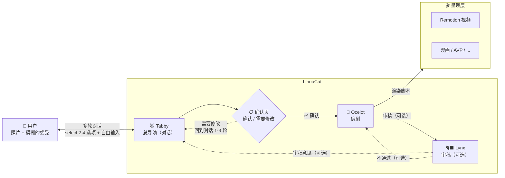

# LihuaCat 未来

## 一句话定义

> **LihuaCat = 🐱 Tabby（理解你）+ StoryBrief（叙事内核）+ 可插拔的呈现层**
> 

LihuaCat 不是视频工具，不是漫画工具。它是一个把「用户的真实照片 + 用户的真实感受」转化成「某种可分享的叙事体验」的系统。

---

## 产品愿景

### 我们在解决什么问题？

大多数人打开相册，看着一堆照片，心里有一团模糊的感觉，但说不出来。"就是觉得那天挺开心的""有点怀念吧"——然后就关掉了。

市面上能做「图片 → 视频」的工具很多（剪映模板、CapCut 一键出片、微信照片电影），但它们解决的是**呈现问题**——怎么把图片排好看。没有人在解决**表达问题**——用户心里那团模糊的感受，怎么变成一个有灵魂的故事。

### LihuaCat 想成为什么？

一个**帮用户搞清楚自己到底想表达什么**的系统。然后把它变成可以分享的叙事体验。

**核心体验承诺**：用户看着最终产出时，会有一个「对，就是这个感觉」的瞬间。

### 和别人不一样的地方

| 维度 | 传统工具 | LihuaCat |
| --- | --- | --- |
| 输入 | 图片 | 图片   **• 用户的感受** |
| 谁决定故事 | AI 或模板 | **用户的感受决定故事**，AI 帮忙表达 |
| 用户做什么 | 选模板、选滤镜、选音乐 | **聊聊天，说说心里话** |
| 产出 | 好看的视频 | **「被理解了」的感觉**  • 承载这种理解的叙事体验 |
| 分享动机 | "看看我做的视频" | **"这就是那天的感觉"** |

### 用户是谁？

暂不锁定具体画像。先从自己出发——Chii 就是第一个用户。

一个直觉：LihuaCat 可能不是一个"随便玩玩"的日常工具，而是一个**在特殊时刻才会打开的东西**——低频但高价值。愿意花时间跟 🐱 Tabby 深聊感受的人，往往是因为那组照片对他们真的很重要。

这个假设需要验证，后续持续更新。

### 怎么验证「被理解」？

最粗暴但最有效的方式：做出来后，用户愿不愿意发给**那个特定的人**看。不是发朋友圈，是发给「那个人」。

### 商业模式

（待探索。但有一个不变的约束——）

- **本地优先**：所有渲染在用户机器上完成
- **用户自带 AI**：AI 能力由用户自己的 Codex/ChatGPT 账号承担
- **开发者零运维**：不跑服务器，不存数据

---

## 地基性的信念

1. **用户真实的图片 + 用户真实的感受 = 有灵魂的叙事体验**
2. **输出形态是可替换的，理解用户的能力是不可替换的**
3. **🐱 Tabby 是产品的灵魂，它的质量决定产品的上限**
4. **本地优先、用户自带 AI、开发者零运维**——这个不变

---

## 三个 Agent：各自干什么、怎么配合

### 🐱 Tabby（狸花）—— 总导演

Tabby 是**唯一和用户直接对话的 agent**，也是整个系统的大脑。狸花猫本猫，LihuaCat 的灵魂。

**它在干什么：** 用户丢过来一堆照片，心里有一团模糊的感觉但说不清楚。Tabby 的工作就是帮用户把这团感觉变成清晰的创作意图。

**具体能力：**

- **看图**——分析照片里有什么（场景、人物、光线、氛围），但永远「戴着用户给的有色眼镜」去看
- **聊天**——多轮对话，追问感受、挖背后故事（"这张是在哪拍的？" "当时什么心情？" "你想发给谁看？"）
    - **交互模式**：每轮给用户 2–4 个建议选项（select），且**必须**带一个「我想自己说…」入口进入自由输入。不做纯开放式提问，降低用户表达门槛
- **判断**——知道什么时候该继续追问，什么时候信息已经够了，可以收束
- **确认页**——收束后、调用 Ocelot 之前，向用户展示人话总结（"我理解你想表达的是：…"）。用户可以「确认」或「需要修改」。点「需要修改」回到对话继续聊 1–3 轮，**不做字段级表单**
- **调度**——决定何时收束进入确认页；确认后由工作流编排调用 StoryBrief 生成与 🐆 Ocelot 编剧（可选启用 🐈‍⬛ Lynx 审稿，默认关闭）

**核心产出：** 用户的创作意图（用户到底想表达什么）+ 每张照片的情感注释。这两样东西组成 StoryBrief 的核心原料。

**一句话：** 没有 Tabby，LihuaCat 和剪映模板没区别。它是产品的灵魂，它的质量决定产品的上限。

### 🐆 Ocelot（虎猫）—— 编剧（工具人）

Ocelot **不和用户对话**，它只服务于 Tabby。美洲虎猫，丛林里最优雅的猎手，擅长在暗处安静地编织。

**它在干什么：** Tabby 聊完之后，把 StoryBrief 交给 Ocelot。Ocelot 读取叙事资产，产出具体的 RenderScript（渲染指令）——哪张图先出、配什么文字、镜头怎么动、节奏怎么走。

**权限：** 被调用、无自主权。Tabby 让它写它就写，让它改它就改。

### 🐈‍⬛ Lynx（猞猁）—— 审稿人（工具人，可选）

Lynx 也**不和用户对话**，同样只服务于 Tabby。古希腊人认为猞猁能看穿墙壁——锐利的双眼，什么都逃不过。

> Lynx 是可选能力：默认不启用，只有在你需要“忠实表达”的质检闭环时才开启。
> 

**它在干什么：** 拿着用户的原始意图（CreativeIntent）+ 照片 + Ocelot 写出来的脚本，做质检。它回答一个核心问题：**「这个脚本忠实地表达了用户的感受吗？」**

比如用户说「克制的温柔，不煽情」，但 Ocelot 写出来的文案用了「岁月静好」——Lynx 就会指出来：这和用户的 avoidance 冲突了。

**权限：** 被调用、无自主权。审完把意见交回 Tabby，由 Tabby 决定怎么处理。

### 三者的协作流程

---

## 核心资产与边界（精简版）

### StoryBrief：叙事资产（可跨呈现层复用）

StoryBrief 是对「用户想表达什么」的结构化沉淀：**意图 + 照片承载的情感 + 叙事节奏**。它只关心叙事，不关心怎么渲染。

**约束：**

- **不包含渲染细节**：不出现帧率、分辨率、转场实现、组件名等
- **可跨呈现层复用**：从视频换到漫画/AVP，不要求 StoryBrief 跟着改
- **可审阅**：允许人类快速读懂“这是不是我想表达的”

### 渲染脚本：呈现层合同（可插拔）

渲染脚本是把 StoryBrief “落地成某种可渲染的指令集”的结果：它对某个 Renderer 来说是**输入合同**。

**约束：**

- **一层只做一件事**：Ocelot 负责把叙事翻译成脚本；Renderer 负责把脚本确定性地映射成作品
- **格式允许多种**：不同 Renderer 可以有不同脚本格式，但都要能追溯回同一份叙事资产
- **失败即问题**：渲染失败优先视为脚本/渲染器的 bug，而不是“换条路再试试”

---

## Agent 速查表

| Agent | 一句话定位 | 和用户对话？ |
| --- | --- | --- |
| **🐱 Tabby（狸花）** | 总导演 + 唯一对话者 | **是** |
| **🐆 Ocelot（虎猫）** | 编剧工具人 | 否 |
| **🐈‍⬛ Lynx（猞猁）** | 审稿工具人 | 否 |

---

## 路线图（只保留“未来/待验证”部分）

### 近期：把“被理解”的命中率做上去

- **Tabby 追问与收束**：更自然、更少轮次、更少“审讯感”；让用户更容易说出那句关键的“原话”
- **确认页体验**：让用户能明确地说“对 / 不对”，并能在不填表的前提下快速修正方向
- **脚本质量稳定性**：同一份意图下，脚本应该可预测；出戏/俗套/违背 avoidance 的概率要持续下降
- **可选审稿闭环**：审稿的目标是“忠实表达”，而不是“文学性更强”；审稿意见要可执行、可收敛

### 中期：呈现层可插拔（不稀释叙事内核）

- **更多 Renderer**：漫画、AVP/沉浸式、长图等
- **音乐/节奏/风格匹配**：把“感觉”更完整地落在时间与节奏上（仍以用户感受为主，不以模板为主）

### 长期：把“你”当成持续存在的人

- **记忆系统**：跨会话记住用户的表达偏好、历史故事与敏感点（默认谨慎、可控、可关闭）
- **动态素材**：从纯静态图片扩展到 Live Photo / 短视频片段（输入、叙事与渲染都要一起升级）

---

## 非目标（至少在现阶段）

- 纯“图片拼模板出片”的产品形态（那不是 LihuaCat）
- 云端存储用户照片/对话（违背本地优先）
- 用更多花活掩盖“没理解用户”的问题
