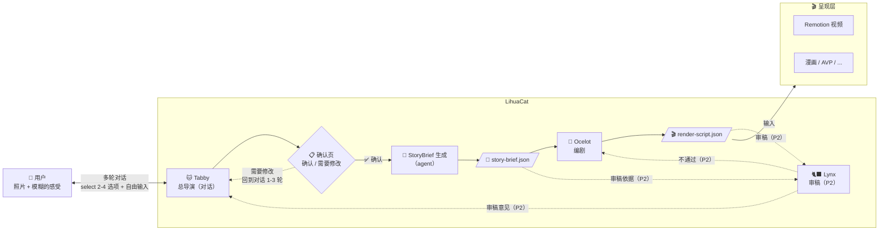
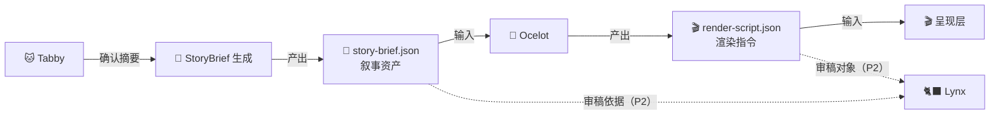

# LihuaCat 未来

## 一句话定义

> **LihuaCat = 🐱 Tabby（理解你）+ StoryBrief（叙事内核）+ 可插拔的呈现层**
> 

LihuaCat 不是视频工具，不是漫画工具。它是一个把「用户的真实照片 + 用户的真实感受」转化成「某种可分享的叙事体验」的系统。

---

## 产品愿景

### 我们在解决什么问题？

大多数人打开相册，看着一堆照片，心里有一团模糊的感觉，但说不出来。"就是觉得那天挺开心的""有点怀念吧"——然后就关掉了。

市面上能做「图片 → 视频」的工具很多（剪映模板、CapCut 一键出片、微信照片电影），但它们解决的是**呈现问题**——怎么把图片排好看。没有人在解决**表达问题**——用户心里那团模糊的感受，怎么变成一个有灵魂的故事。

### LihuaCat 想成为什么？

一个**帮用户搞清楚自己到底想表达什么**的系统。然后把它变成可以分享的叙事体验。

**核心体验承诺**：用户看着最终产出时，会有一个「对，就是这个感觉」的瞬间。

### 和别人不一样的地方

| 维度 | 传统工具 | LihuaCat |
| --- | --- | --- |
| 输入 | 图片 | 图片   **• 用户的感受** |
| 谁决定故事 | AI 或模板 | **用户的感受决定故事**，AI 帮忙表达 |
| 用户做什么 | 选模板、选滤镜、选音乐 | **聊聊天，说说心里话** |
| 产出 | 好看的视频 | **「被理解了」的感觉**  • 承载这种理解的叙事体验 |
| 分享动机 | "看看我做的视频" | **"这就是那天的感觉"** |

### 用户是谁？

暂不锁定具体画像。先从自己出发——Chii 就是第一个用户。

一个直觉：LihuaCat 可能不是一个"随便玩玩"的日常工具，而是一个**在特殊时刻才会打开的东西**——低频但高价值。愿意花时间跟 🐱 Tabby 深聊感受的人，往往是因为那组照片对他们真的很重要。

这个假设需要验证，后续持续更新。

### 怎么验证「被理解」？

最粗暴但最有效的方式：做出来后，用户愿不愿意发给**那个特定的人**看。不是发朋友圈，是发给「那个人」。

### 商业模式

（待探索。但有一个不变的约束——）

- **本地优先**：所有渲染在用户机器上完成
- **用户自带 AI**：AI 能力由用户自己的 Codex/ChatGPT 账号承担
- **开发者零运维**：不跑服务器，不存数据

---

## 地基性的信念

1. **用户真实的图片 + 用户真实的感受 = 有灵魂的叙事体验**
2. **输出形态是可替换的，理解用户的能力是不可替换的**
3. **🐱 Tabby 是产品的灵魂，它的质量决定产品的上限**
4. **本地优先、用户自带 AI、开发者零运维**——这个不变

---

## 三个 Agent：各自干什么、怎么配合

### 🐱 Tabby（狸花）—— 总导演

Tabby 是**唯一和用户直接对话的 agent**，也是整个系统的大脑。狸花猫本猫，LihuaCat 的灵魂。

**它在干什么：** 用户丢过来一堆照片，心里有一团模糊的感觉但说不清楚。Tabby 的工作就是帮用户把这团感觉变成清晰的创作意图。

**具体能力：**

- **看图**——分析照片里有什么（场景、人物、光线、氛围），但永远「戴着用户给的有色眼镜」去看
- **聊天**——多轮对话，追问感受、挖背后故事（"这张是在哪拍的？" "当时什么心情？" "你想发给谁看？"）
    - **交互模式**：每轮给用户 2–4 个建议选项（select），且**必须**带一个「我想自己说…」入口进入自由输入。不做纯开放式提问，降低用户表达门槛
- **判断**——知道什么时候该继续追问，什么时候信息已经够了，可以收束
- **确认页**——收束后、调用 Ocelot 之前，向用户展示人话总结（"我理解你想表达的是：…"）。用户可以「确认」或「需要修改」。点「需要修改」回到对话继续聊 1–3 轮，**不做字段级表单**
- **调度**——决定何时收束进入确认页；确认后由工作流编排调用 StoryBrief 生成与 🐆 Ocelot 编剧（🐈‍⬛ Lynx 审稿为 P2 规划）

**核心产出：** `CreativeIntent`（用户到底想表达什么）+ `PhotoNote[]`（每张照片的情感标注）。这两样东西组成 StoryBrief 的核心原料。

**一句话：** 没有 Tabby，LihuaCat 和剪映模板没区别。它是产品的灵魂，它的质量决定产品的上限。

### 🐆 Ocelot（虎猫）—— 编剧（工具人）

Ocelot **不和用户对话**，它只服务于 Tabby。美洲虎猫，丛林里最优雅的猎手，擅长在暗处安静地编织。

**它在干什么：** Tabby 聊完之后，把 StoryBrief 交给 Ocelot。Ocelot 读取叙事资产，产出具体的 RenderScript（渲染指令）——哪张图先出、配什么文字、镜头怎么动、节奏怎么走。

**权限：** 被调用、无自主权。Tabby 让它写它就写，让它改它就改。

### 🐈‍⬛ Lynx（猞猁）—— 审稿人（工具人，P2 规划）

Lynx 也**不和用户对话**，同样只服务于 Tabby。古希腊人认为猞猁能看穿墙壁——锐利的双眼，什么都逃不过。

> 当前版本尚未接入主流程；先把“审稿能力”当作质量门槛的设计预留。
> 

**它在干什么：** 拿着用户的原始意图（CreativeIntent）+ 照片 + Ocelot 写出来的脚本，做质检。它回答一个核心问题：**「这个脚本忠实地表达了用户的感受吗？」**

比如用户说「克制的温柔，不煽情」，但 Ocelot 写出来的文案用了「岁月静好」——Lynx 就会指出来：这和用户的 avoidance 冲突了。

**权限：** 被调用、无自主权。审完把意见交回 Tabby，由 Tabby 决定怎么处理。

### 三者的协作流程



---

## 两份核心数据：StoryBrief 与 RenderScript

### StoryBrief：叙事资产（核心资产）

StoryBrief 是整个系统的**核心资产**，描述「用户想表达什么、照片承载什么情感、故事怎么走」。它**只关心叙事**，不包含任何渲染细节。

**产出者：** StoryBrief 生成器（agent，输入为 Tabby 对话 + confirmed summary）

**消费者：** 🐆 Ocelot（读取 StoryBrief 来写渲染脚本）；🐈‍⬛ Lynx（P2，读取 StoryBrief 来审稿）

**关键特性：** 即使换掉整个呈现层（从视频换成漫画、AVP），StoryBrief 不需要改动。它是「理解用户」的结晶，和输出形态无关。

```tsx
// story-brief.json —— 叙事资产，不含任何渲染细节
interface StoryBrief {
  intent: CreativeIntent
  photos: PhotoNote[]
  narrative: NarrativeStructure
}

interface CreativeIntent {
  coreEmotion: string       // "异地重逢的珍贵感"
  tone: string              // "克制的温柔，不煽情"
  narrativeArc: string      // "从期待 → 见面的小确幸 → 离别前的沉默"
  audienceNote: string | null // "发给她看的，她会懂"（可选，用户可跳过；null 时 Ocelot 默认"给自己看"的语气）
  avoidance: string[]       // ["不要用'岁月静好'这种词"]
  rawUserWords: string      // 保留用户原话，供后续 agent 参考语气
}

interface PhotoNote {
  photoRef: string
  userSaid: string          // 用户关于这张图的原话（如果聊过）
  emotionalWeight: number   // 0-1
  suggestedRole: string     // "开场" | "高潮" | "转折" | "收尾" | "过渡"
  backstory: string         // 用户聊出来的背后故事
  analysis: string          // AI 的视觉分析（戴着眼镜的）
}

interface NarrativeStructure {
  arc: string
  beats: StoryBeat[]
}

interface StoryBeat {
  photoRefs: string[]
  moment: string
  emotion: string
  duration: "short" | "medium" | "long"
  transition: string        // 叙事层的过渡意图（如 "渐入" "突然切换"）
}
```

### RenderScript：渲染指令（呈现层合同）

RenderScript 是 🐆 Ocelot 读取 StoryBrief 后产出的**具体渲染指令**，直接替代现有的 `story-script.json`。它告诉呈现层「每一帧具体怎么做」。

**产出者：** 🐆 Ocelot

**消费者：** 呈现层（Remotion 视频 / 漫画 / AVP 等）

**关键特性：** 不同的呈现层可以有不同的 RenderScript 格式。换呈现层时，改的是 Ocelot 的输出格式和 Renderer 的消费逻辑，StoryBrief 不动。

```tsx
// render-script.json —— 渲染指令，呈现层直接消费
interface RenderScript {
  storyBriefRef: string     // 关联的 story-brief.json 路径
  video: {
    width: number           // P1 系统固定：1080
    height: number          // P1 系统固定：1920
    fps: number             // P1 系统固定：30
  }
  scenes: RenderScene[]
}

interface RenderScene {
  sceneId: string
  photoRef: string          // 对应的图片
  subtitle: string          // 字幕文案
  subtitlePosition: string  // "bottom" | "top" | "center"
  durationSec: number       // 秒
  transition: RenderTransition
  kenBurns?: KenBurnsEffect // 镜头运动（可选）
}

interface RenderTransition {
  type: string              // "fade" | "cut" | "dissolve" | "slide"
  durationMs: number
  direction?: string        // "left" | "right" | "up" | "down"（仅 slide 需要；其他类型可省略）
}

interface KenBurnsEffect {
  startScale: number        // 起始缩放 eg. 1.0
  endScale: number          // 结束缩放 eg. 1.2
  panDirection: string      // "left" | "right" | "up" | "down" | "center"
}
```

### 两者的关系



> **换呈现层时：** StoryBrief 不动，只改 Ocelot 的 RenderScript 输出格式 + Renderer 的消费逻辑。
> 

---

## Agent 速查表

| Agent | 一句话定位 | 和用户对话？ |
| --- | --- | --- |
| **🐱 Tabby（狸花）** | 总导演 + 唯一对话者 | **是** |
| **🐆 Ocelot（虎猫）** | 编剧工具人 | 否 |
| **🐈‍⬛ Lynx（猞猁）** | 审稿工具人 | 否 |

---

## 分阶段落地

**策略：破坏性重构**——不做旧结构兼容，直接用新架构替换整个中间层。每个阶段都是可独立验证的 MVP。

**现状（截至 v0.2.0）：**

- P1 已落地：[P1（Tabby → StoryBrief → Ocelot → RenderScript → Remotion）实施计划](https://www.notion.so/P1-Tabby-StoryBrief-Ocelot-RenderScript-Remotion-304be9d6386a80b0a921d925a68cc136?pvs=21)
- P2 规划中：Lynx 审稿与脚本修改循环

**关键决策：**

- 目录选择与素材校验（能力 A）保留不动
- 能力 B（交互式偏好收集）+ 能力 C（故事脚本生成）整体替换为 Tabby 对话 + StoryBrief + Ocelot 编剧
- 现有 `story-script.json` 结构废弃，改用场景化的 `render-script.json`（`scenes[]` + `transition` + `kenBurns`）
- 现有 template / ai_code 双渲染模式废弃，保留现有 Remotion 模板组件（图片铺满、字幕渐变底），在模板内新增实现转场动画与 Ken Burns，数据源从 `story-script.json` 切换到 `render-script.json`
- ai_code 彻底删除，不保留为自动兜底。渲染失败即报错退出，因为新架构下渲染器是确定性映射（render-script → video），失败说明渲染器有 bug 或 render-script 数据有问题，切换路径不解决根因
- 能力 D（渲染策略选择）废弃（不再有模式选择），能力 E（本地渲染与产物落盘）保留但重构输入源
- `RenderScript.video` 参数由系统固定（1080×1920, 30fps），不由 Ocelot 决定
- `RenderScript` 要求“每张图片至少使用一次”，并写入校验与 Ocelot prompt 的硬约束
- `slide` 转场方向可配置，但 P1 的 Ocelot 只生成 `left`/`right`

---

### P1：🐱 Tabby 看图对话 + 🐆 Ocelot 编剧 + StoryBrief 数据合同（已落地）

[P1（Tabby → StoryBrief → Ocelot → RenderScript → Remotion）实施计划](https://www.notion.so/P1-Tabby-StoryBrief-Ocelot-RenderScript-Remotion-304be9d6386a80b0a921d925a68cc136?pvs=21) 

**目标：** 端到端跑通完整的「看图对话 → StoryBrief → Ocelot 写脚本 → 渲染出片」闭环。Tabby 从第一步就具备多模态看图能力，Ocelot 作为独立 agent 负责编剧。

**落地内容：**

1. **类型定义**：在代码中定义 `StoryBrief`（CreativeIntent + PhotoNote[] + NarrativeStructure）和 `RenderScript`（RenderScene[]）两套类型，删除现有 `story-script` 相关类型
2. **🐱 Tabby 多模态对话**：替换现有的「能力 B：交互式偏好收集」
    - 看图：分析照片内容（场景、人物、光线、氛围），「戴着用户给的有色眼镜」去看
    - 聊天：多轮对话追问感受、挖背后故事，结合视觉信息提问（"这张海边的合影是在哪拍的？"）
    - 收束：判断信息够了就停，产出 `CreativeIntent` + 完整的 `PhotoNote[]`（含视觉分析 + 情感权重）
3. **StoryBrief 生成器（agent）**：基于 Tabby 的对话历史 + confirmed summary 生成 `story-brief.json`（带结构校验与重试）
4. **🐆 Ocelot 独立 agent**：由工作流编排调用
    - 输入：完整的 `story-brief.json`
    - 输出：`render-script.json`（具体渲染指令：每个 scene 的字幕文案、镜头运动、过场方式、时长等）
5. **Remotion 渲染器改造**：保留现有模板组件（图片铺满、字幕渐变底），在模板内新增实现转场动画（fade/cut/dissolve/slide）与 Ken Burns 效果。数据源从 `story-script.json` 切换到 `render-script.json` 的 `scenes[]`。废弃 template / ai_code 双模式选择逻辑，只保留单一渲染路径，失败即报错退出
6. **删除旧代码**：删除 `story-script.json` 相关生成逻辑、askStyle/askPrompt 交互、渲染模式选择逻辑（能力 D）

**Tabby 对话合同（P1）**

- Tabby 每一轮必须返回**结构化 JSON**（使用 outputSchema 强约束），字段：`say`、`options[]`、`done`、`internalNotes`
- `options[]` 用于渲染 TUI 的 select（方向键选择），长度必须为 2–4，且必须包含 `id === "free_input"` 的选项（例如「我想自己说…」）
- 选择 `free_input` 时，进入自由输入框（text），用户输入的文本作为该轮回答
- `done === true` 表示进入「确认页」：`say` 为人话总结；`options` 固定为 `confirm` / `revise` 二选一
- `done === true` 时，`options` 固定为：
    - `{ id: "confirm", label: "就是这个感觉" }`
    - `{ id: "revise", label: "需要修改" }`
- 用户选择 `revise`：回到对话继续聊（最多 3 轮），Tabby 再次 `done === true` 后回到确认页；不做字段级表单编辑
- `internalNotes` 会被落盘到对话日志中用于调试，但**不展示**给用户
- Tabby 的“受众（发给谁看）”为可选项：会问，但允许跳过

**不做：**

- 不做 🐈‍⬛ Lynx 审稿（留给 P2）
- 不做基于审稿的脚本重写循环（留给 P2）；P1 默认一次生成定稿，失败即报错退出
- 不保留 story-script 数据结构、template/ai_code 模式选择逻辑、能力 B/C/D 的交互代码（破坏性重构，不做向后兼容）
- Remotion 模板的现有组件（图片铺满、字幕渐变底）保留并改造，转场动画与 Ken Burns 为新增实现
- 已完成文档与测试基线迁移到 RenderScript（不再依赖 story-script / mode-sequence 等旧概念）

**产出文件（用于调试/审核）：**

| 文件 | 内容 | 调试用途 |
| --- | --- | --- |
| `tabby-conversation.jsonl` | 完整对话历史（用户消息 + Tabby JSON 输出 + internalNotes + 时间戳） | 审阅对话质量：Tabby 追问是否自然、收束时机是否合理；回放现场用于调试 |
| `story-brief.json` | StoryBrief 生成器产出的叙事资产（CreativeIntent + PhotoNote[] + NarrativeStructure） | 审阅叙事质量：CreativeIntent 是否忠实、beats 是否合理 |
| `render-script.json` | Ocelot 产出的渲染指令（RenderScene[]），呈现层直接消费 | 审阅渲染指令：字幕文案、镜头运动、过场方式是否匹配叙事意图 |
| `ocelot-input.json` | 提供给 Ocelot 的输入快照（`storyBriefRef` + `storyBrief`） | 定位问题：如果渲染指令质量差，先看叙事输入是否充分 |
| `ocelot-output.json` | Ocelot 产出的 render-script 候选（结构化/清洗后；通常与 `render-script.json` 内容一致） | 对比生成候选与最终落盘脚本，定位清洗/校验问题 |
| `ocelot-prompt.log` | 发给 Ocelot 的实际 prompt | 调 prompt 用 |
| `run.log` | 管线执行日志（runId/sourceDir/关键阶段状态与 attempts/错误信息） | 排错与复盘 |

**验收标准：**

- ✅ Tabby 能在对话中提及照片的具体内容（"这张是两个人在海边的合影对吗？"）
- ✅ `story-brief.json` 的 CreativeIntent 字段全部填充，PhotoNote[] 长度等于输入图片数且含视觉分析和情感权重，NarrativeStructure 包含完整 beats
- ✅ `render-script.json` 的 scenes 数量合理，每个 scene 包含字幕文案、过场方式、时长
- ✅ 端到端跑通：看图对话 → `story-brief.json` → Ocelot 产出 `render-script.json` → 渲染 → `video.mp4` 落盘
- ✅ 所有中间文件可以人工审阅，方便定位「哪一步的质量不行」

---

### P2：🐈‍⬛ Lynx 审稿 + 修改循环

**目标：** 加入质检环节，Tabby 调度 Ocelot 写 → Lynx 审 → 不通过则 Tabby 指导 Ocelot 重写，直到通过。

**做什么：**

- Lynx 作为独立 agent，Tabby 通过 tool call 调用
- Lynx 拿着 `story-brief.json`（叙事资产）+ `render-script.json`（渲染指令），检查「渲染指令是否忠实于叙事意图」
- 不通过时：Lynx 产出具体修改意见 → Tabby 转发给 Ocelot → Ocelot 修改 → 再审
- 设置最大修改轮次（如 3 轮），超过则 Tabby 取最后一版定稿

**不做：**

- 不做用户参与的修改循环（用户只在 Tabby 对话阶段参与）

**产出文件（新增）：**

| 文件 | 内容 | 调试用途 |
| --- | --- | --- |
| `lynx-review-{N}.json` | Lynx 第 N 轮审稿意见（通过/不通过 + 具体问题） | 审阅审稿质量：是否抓到了真正的问题 |
| `ocelot-revision-{N}.json` | Ocelot 第 N 轮修改后的脚本 | 追踪每轮修改的变化 |
| `lynx-prompt.log` | 发给 Lynx 的实际 prompt | 调 prompt 用 |

**验收标准：**

- ✅ Lynx 能识别出脚本与用户 avoidance 的冲突（如用户说「不要岁月静好」但脚本用了）
- ✅ 修改循环能收敛（在最大轮次内通过或定稿）
- ✅ 经过 Lynx 审稿的最终脚本质量明显优于未审稿版本
- ✅ 所有审稿轮次的中间文件可追溯

---

### 后续阶段（待规划）

- **P3**：更多 Renderer（漫画、AVP 沉浸式等）+ 音乐/风格自动匹配
- **P4**：Tabby 记忆系统——跨会话记住用户的表达偏好、历史故事、情感模式
- **P5**：实况照片（Live Photo）支持——将动态照片作为素材输入，渲染层支持动态视频片段而非纯静态图片