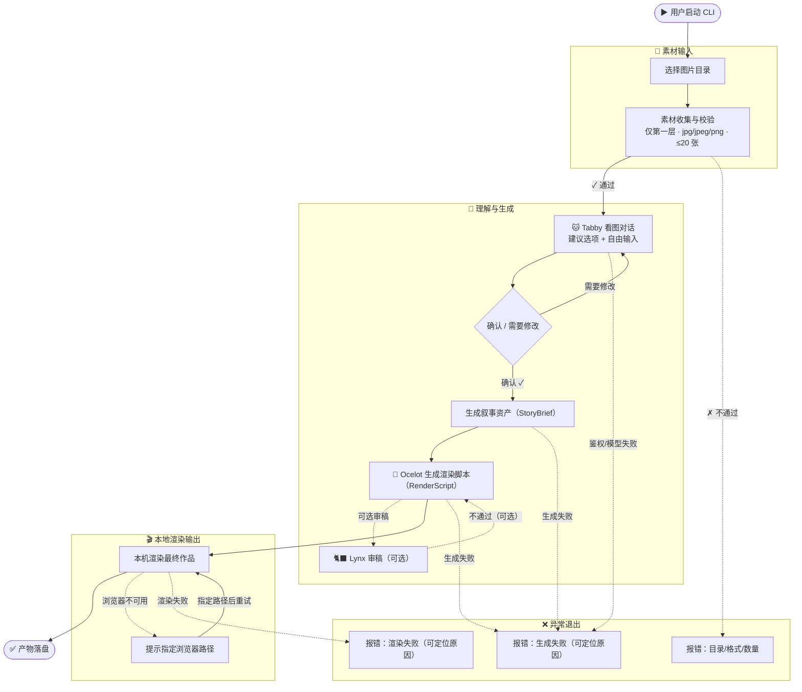

# LihuaCat 业务全局地图

## 1) 产品概述

LihuaCat 是一个本地优先的交互式 CLI：把“用户的一组真实照片 + 用户当下真实的感受”转化成“可分享的叙事体验”（当前主要以短视频呈现）。

- 给谁用：有一组“对自己很重要”的照片，想把“那天的感觉”表达清楚并分享给特定的人（或留给自己）的用户
- 核心体验：选图片目录 → 🐱 Tabby 看图对话把感受聊清楚 → 用户确认 → 🐆 Ocelot 把叙事资产翻译成渲染脚本 → 本机渲染出作品
- 输入：一个目录下的若干张图片（仅扫描第一层）
- 输出：本地落盘的一次性产物（最终作品 + 可审阅的叙事资产与过程记录）

## 2) 核心执行单元（Agents / Subagents / Tools）

> 这里按“谁在执行”来陈列（agents / subagents / tools），而不是按传统“能力模块”拆分。

### Agents（面向意图的决策与生成）

#### 🐱 Tabby（对话导演）

- 用户价值：把用户“模糊的感受”聊清楚，形成用户可确认的表达意图
- 触发方式：素材通过校验后开始
- 输入：图片列表 + 用户多轮输入
- 输出：对话记录 + 最终确认摘要（用户可读、可确认）
- 关键边界与失败方式（用户视角）：
  - 每轮提供“建议选项 + 自由输入”两种表达路径，降低用户表达门槛
  - 信息足够后进入确认页：用户可以“确认 / 需要修改”；选择“需要修改”会回到对话继续聊（有上限避免无限循环）

#### 🐆 Ocelot（编剧）

- 用户价值：把叙事资产翻译成“呈现层可消费的渲染脚本”，让出片更确定
- 触发方式：StoryBrief 生成后开始
- 输入：StoryBrief + 图片列表
- 输出：RenderScript（渲染脚本）
- 关键边界与失败方式（用户视角）：
  - 生成失败会直接报错退出，并留下可定位原因的错误信息

#### 🐈‍⬛ Lynx（审稿，可选）

- 用户价值：做“忠实表达用户感受”的质检，降低出戏/俗套/违背用户禁忌的概率
- 触发方式：Ocelot 产出脚本后（可选启用）
- 输入：StoryBrief + RenderScript + 图片素材
- 输出：审稿意见（通过/不通过 + 可执行修改建议）
- 关键边界与失败方式（用户视角）：
  - 目标是“忠实表达”，不是“文风更华丽”
  - 审稿需要可收敛（有限轮次），否则会退出并留下可定位原因的错误信息

### Subagents（把某一步做成稳定的子任务）

#### StoryBrief 生成器（叙事资产整理）

- 用户价值：把对话中分散的信息合成为结构化叙事资产，作为后续脚本/呈现层的稳定输入
- 触发方式：用户在确认页点击“确认”后开始
- 输入：图片列表 + 对话记录 + confirmed summary
- 输出：StoryBrief（叙事资产）
- 失败方式：生成失败时报错退出，并留下可定位原因的错误信息

### Tools（确定性的本地能力）

#### 素材收集与校验工具

- 用户价值：把“可用素材集”稳定收敛成确定输入，避免中途失败
- 触发方式：用户选择/提供图片目录后立即发生
- 输入：目录第一层的图片文件
- 输出：被接受的图片列表，或明确的错误提示
- 关键边界与失败方式（用户视角）：
  - 只扫描第一层（不递归子目录）
  - 仅支持 `jpg/jpeg/png`
  - 最多 20 张
  - 目录中一旦出现不支持的格式（如 `webp/heic/heif/gif/bmp/tiff/avif`）会直接报错

#### 本地渲染工具

- 用户价值：在用户机器本地完成渲染，产物可直接拿走分享
- 触发方式：RenderScript 生成后执行
- 输入：RenderScript + 图片素材
- 输出：最终作品文件（当前为视频）与本次运行的必要过程记录
- 关键边界与失败方式（用户视角）：
  - 依赖可用的浏览器运行环境；若自动探测失败，用户需要手动指定浏览器可执行文件位置

## 3) 核心用户流程（User Journeys）

### 流程 1：标准出片闭环

1. 用户选择一个图片目录
2. 系统校验目录素材并给出明确可用/不可用结论
3. 🐱 Tabby 看图聊天（多轮对话 + 选项 + 自由输入）
4. 确认页：用户确认 / 需要修改
5. 系统生成叙事资产（StoryBrief）
6. 🐆 Ocelot 生成渲染脚本（RenderScript）
7. 系统在本机渲染最终作品
8. 产物落盘，用户获得可分享的作品文件

### 流程 2：需要修改（回到对话继续聊）

1. Tabby 进入确认页
2. 用户选择“需要修改”
3. 回到对话继续聊（有限轮次，避免无限循环）
4. 再次进入确认页，直到用户确认或达到上限后退出

### 流程 3：浏览器探测失败时的手动指定

1. 系统提示浏览器启动失败/未找到可用浏览器
2. 用户提供浏览器可执行文件位置
3. 系统使用该浏览器继续完成渲染

## 4) 业务流程图（Mermaid）

## 5) 业务规则与约束（Rules & Constraints）

- 输入目录仅扫描第一层文件，不递归
- 仅支持 `jpg/jpeg/png`，最多 20 张
- 目录内出现任意不支持格式会直接报错（防止“部分可用”导致结果不可预期）
- 渲染失败会直接报错退出（不做“换一种模式自动兜底”的降级）
- 交互形态为 TUI，必须在 TTY 终端中运行；非 TTY 环境会直接报错退出
- 本地优先：不把用户照片/对话上传到云端作为产品默认路径

## 6) 产物与可见结果（Outputs）

默认产物目录：输入目录下的 `lihuacat-output/<runId>/`

常见产物：

- 最终作品文件（当前主要为视频）
- StoryBrief（叙事资产，便于人类审阅“是否表达准确”）
- RenderScript（渲染脚本，作为呈现层输入合同）
- 对话记录与运行日志（便于复盘与定位问题）
- 错误信息（失败时可定位原因）

## 7) 术语表（Glossary）

- StoryBrief：叙事资产（用户想表达什么 + 照片承载的情感 + 叙事结构）
- RenderScript：渲染脚本（把叙事资产翻译成某个呈现层可消费的指令集）
- runId：一次运行的唯一标识，用于隔离产物目录
- tool：确定性的本地能力（如素材校验、渲染执行），不负责“理解用户”
- agent：面向意图的生成与决策单元（如对话、编剧、审稿）

## 8) 入口索引（可选）

- `src/index.ts`：CLI 入口与交互起点
- `src/flows/create-story-video/create-story-video.flow.ts`：端到端用户流程编排入口
- `src/pipeline.ts`：对外门面（主流程入口）
- `src/story-template/`：内置模板相关实现
