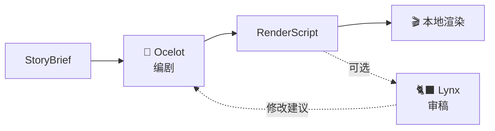
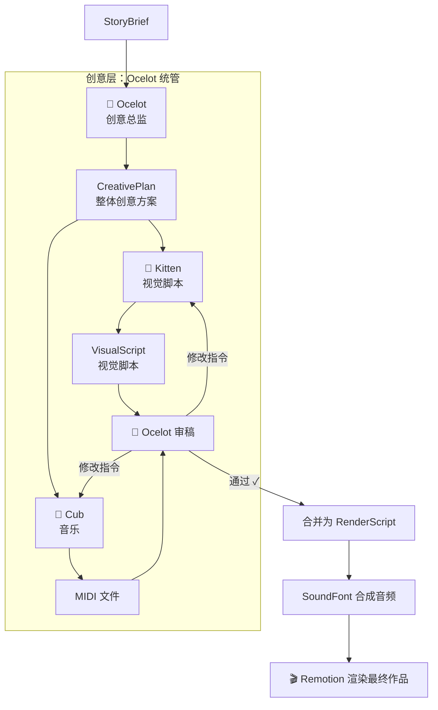

## Goal

为 LihuaCat 新增**本地音乐生成能力**，同时将 Ocelot 从"编剧"升级为**创意总监**，统管视觉与音乐的创意决策、分发与审稿。

---

## Non-goals

- 不做云端音乐生成（守住本地优先 + 用户自带 AI + 开发者零运维）
- 不做带人声/歌词的音乐（仅纯音乐）
- 不做本地专用音乐模型集成（首版用 LLM 直接生成 MIDI JSON，后续可替换引擎）
- 不做音乐风格的用户自定义（首版由 Ocelot 的创意方案决定）

---

## 架构变更总览

### 现有架构



### 新架构



---

## 核心执行单元变更

<aside>
🐾

**命名规则**：Agent（如 🐱 Tabby、🐆 Ocelot）使用成年猫科动物命名，拥有独立决策权；Sub-agent（如 🐾 Kitten、🐾 Cub）使用年幼猫科动物命名，是 Agent 下属的专项执行器，不具备独立决策权。

</aside>

### 🐆 Ocelot（编剧 → 创意总监）

- **新职责**：
    1. 读取 StoryBrief，产出 **CreativePlan**（整体创意方案，含视觉方向 + 音乐意图）
    2. 将 CreativePlan 分发给 Kitten（视觉脚本）和 Cub（音乐）
    3. 收集两者产出，做**统一审稿**：忠实度（是否表达了用户感受）+ 一致性（视觉与音乐是否对齐）
    4. 审稿不通过时，给对应 sub-agent（Kitten / Cub）**具体修改指令**（改稿制，不重跑）
- **取代 Lynx**：审稿职责内化为 Ocelot 的"收活审稿"环节
- **轮次上限**：审稿-改稿循环最多 **3 轮**，超限则以当前版本为准并记录警告

### 🐾 Kitten — 视觉脚本 Sub-agent（新，从 Ocelot 拆出）

- **输入**：CreativePlan 中的视觉方向 + 图片列表
- **输出**：VisualScript（分镜顺序、时长、转场、字幕文案、情绪节奏）
- **本质**：原来 Ocelot 亲自干的活，现在独立为 sub-agent
- **支持改稿**：接收 Ocelot 的修改指令，在原稿基础上修改

### 🐾 Cub — 音乐 Sub-agent（新增）

- **输入**：CreativePlan 中的音乐意图（情绪弧线、节奏走向、关键转折点、总时长）
- **输出**：MIDI JSON → 确定性 tool 写入 `.mid` 文件（纯音乐，4 轨道：钢琴、弦乐、贝斯、鼓）
- **生成方式**：LLM（Codex/ChatGPT）+ prompt + outputSchema 强约束，直接生成 MIDI JSON
- **轨道配置**（首版固定）：
    - 🎹 Piano（channel 0, program 0）— 旋律/和弦主力
    - 🎻 Strings（channel 1, program 48）— 铺底/情绪渲染
    - 🎸 Bass（channel 2, program 33）— 低频支撑
    - 🥁 Drums（channel 9, program 0）— 节奏骨架
- **支持改稿**：接收 Ocelot 的修改指令，在原 MIDI JSON 基础上调整（天然支持，因为输入输出都是结构化 JSON）

### 🐈‍⬛ Lynx（取消）

- 审稿职责已并入 Ocelot 的创意总监角色
- 不再作为独立 agent 存在

---

## 新增数据合同

### CreativePlan（创意方案）

Ocelot 审阅 StoryBrief 后产出的整体创意方案，是 Kitten 和 Cub 的共同输入：

- **叙事弧线**：整体情绪走向（开篇 → 发展 → 高潮 → 收束）
- **视觉方向**：分镜风格、节奏基调、转场基调、字幕风格
- **音乐意图**（由 Ocelot 指定，Cub 的输入合同）：
    - 整体情绪关键词（如"温暖怀旧""轻快明亮"）
    - 节奏走向（与叙事弧线对齐的 BPM 变化趋势）
    - 关键转折点时间标记（与分镜对齐）
    - 配器建议（可选，如"钢琴为主""弦乐铺底"）
    - **总时长**（由 Ocelot 决定，Cub 按此生成；与视频时长不强制对齐）
- **对齐约束**：视觉和音乐必须在哪些时间点/情绪节点对齐

### VisualScript（视觉脚本）

从 RenderScript 中拆出的视觉部分，和现有 RenderScript 的视觉内容基本一致。

### MIDI JSON Schema（Cub 输出合同）

Cub 通过 LLM outputSchema 强约束输出以下结构，确定性 tool 将其写入 `.mid` 文件：

```json
{
  "bpm": 90,
  "timeSignature": "4/4",
  "durationMs": 45000,
  "tracks": [
    {
      "name": "Piano",
      "channel": 0,
      "program": 0,
      "notes": [
        { "pitch": 60, "startMs": 0, "durationMs": 500, "velocity": 80 }
      ]
    },
    {
      "name": "Strings",
      "channel": 1,
      "program": 48,
      "notes": [...]
    },
    {
      "name": "Bass",
      "channel": 2,
      "program": 33,
      "notes": [...]
    },
    {
      "name": "Drums",
      "channel": 9,
      "program": 0,
      "notes": [...]
    }
  ]
}
```

字段说明：

- `bpm`：每分钟节拍数
- `timeSignature`：拍号（首版固定 `"4/4"`）
- `durationMs`：目标总时长（毫秒），由 CreativePlan 的音乐意图指定
- `tracks[].channel`：MIDI 通道（`9` 为 GM 标准打击乐通道）
- `tracks[].program`：GM 标准乐器编号
- `notes[].pitch`：MIDI 音高（0-127，60 = C4）
- `notes[].startMs`：音符起始时间（毫秒）
- `notes[].durationMs`：音符持续时间（毫秒）
- `notes[].velocity`：力度（0-127，控制音量与表现力）

JSON → `.mid` 转换使用 Node.js 库（如 `midi-writer-js` 或 `@tonejs/midi`）。

### RenderScript（渲染脚本，更新）

审稿通过后，由 VisualScript + MIDI 引用合并而成：

- 视觉指令（来自 VisualScript）
- 音频引用（指向生成的 MIDI → 合成后的音频文件路径）
- 合并逻辑由确定性 tool 完成，不涉及 LLM 判断

---

## 新增执行链路（渲染阶段）

```
MIDI 文件
  → SoundFont/合成器本地渲染 → WAV/MP3 音频文件
  → Remotion 将音频 + 视觉素材合成最终视频
```

- **SoundFont**：首版内置 **FluidR3_GM**（~140MB，通用 GM SoundFont，钢琴/弦乐/贝斯/鼓音色覆盖全），后续可支持用户自选
- **合成工具**：**FluidSynth 命令行**（`brew install fluid-synth`），一行命令完成合成：

```bash
fluidsynth -ni FluidR3_GM.sf2 music.mid -F music.wav -r 44100
```

- **音视频时长不匹配处理**：不做任何补偿。音乐比视频短则视频尾部无声，视频比音乐短则视频尾部无画面。Remotion 合成时取两者最大值作为总时长

---

## 用户流程变更

用户侧**零感知**——流程体验不变：

1. 选图片目录
2. 🐱 Tabby 聊感受
3. 确认
4. 等渲染
5. 拿到**带原创配乐的视频**（而不是无声/默认配乐视频）

唯一区别：产物目录多一个 MIDI 文件和合成后的音频文件。

---

## 错误处理与降级

- **Cub（音乐）生成失败**：Ocelot 可选择 fallback 到无配乐渲染，并在产物日志中记录
- **SoundFont 合成失败**：报错退出，留下 MIDI 文件供用户自行处理
- **审稿-改稿超限**：以当前版本为准继续渲染，日志记录警告

---

## 产物变更

`lihuacat-output/<runId>/` 新增：

- `creative-plan.json`：Ocelot 的整体创意方案（可审阅）
- `visual-script.json`：视觉脚本（从 RenderScript 拆出）
- `music.mid`：生成的 MIDI 文件（可审阅、可独立播放）
- `music.wav`（或 `.mp3`）：SoundFont 合成后的音频
- `review-log.json`：Ocelot 审稿记录（每轮的通过/不通过 + 修改指令）

---

## 术语表更新

- **CreativePlan**：Ocelot 产出的整体创意方案，视觉和音乐 sub-agent 的共同输入合同
- **VisualScript**：视觉脚本，从 RenderScript 拆出的视觉指令部分
- **Kitten（视觉脚本 Sub-agent）**：负责"创意方案 → 视觉分镜脚本"的专项执行器（原 Ocelot 的核心工作），以"幼猫"命名，表示 Ocelot 的下属执行者
- **Cub（音乐 Sub-agent）**：负责"文本描述 → MIDI"的专项执行器，以"幼崽"命名，表示 Ocelot 的下属执行者
- **改稿制**：审稿不通过时，由 Ocelot 给出具体修改指令，sub-agent 在原稿上修改（非重跑）

---

## 已拍板

- [x]  **MIDI 生成技术路径**：LLM（Codex/ChatGPT）直接生成 MIDI JSON，确定性 tool 写入 `.mid`（后续可替换为本地专用模型）
- [x]  **SoundFont 选型与合成工具链**：FluidR3_GM + FluidSynth 命令行
- [x]  **MIDI JSON Schema**：见上方「MIDI JSON Schema（Cub 输出合同）」章节
- [x]  **审稿-改稿轮次上限**：N=3
- [x]  **音视频时长不匹配**：不补偿，各跑各的长度，Remotion 取最大值
- [x]  **轨道配置**：4 轨（钢琴/弦乐/贝斯/鼓），首版固定，GM 标准乐器编号